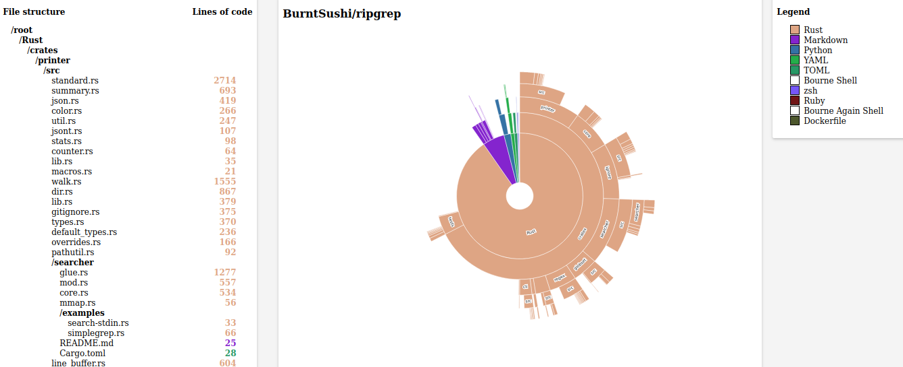

<h1 align="center">clocviz</h1>

<h2 align="center"><i>Create interactive visualizations out of your codebases!</i></h2>

<p align="center">
  <a href="https://golang.org/doc/go1.15">
     
  <a href="https://opensource.org/licenses/MIT">
    
  <a>
    
</p>
    
clocviz is a command-line tool used to analyze a target codebase and render interactive visualizations; users can traverse the file tree with a simple mouse click and see statistics including lines by file, lines by language, percentage composition per language, etc.

clocviz is primarily written in Go, using the language's templates and web server capabilities to reduce dependencies. Visualizations are performed through D3.js and vanilla HTML/CSS/JS.

Please note that clocviz is an extension of [cloc](https://github.com/AlDanial/cloc).

## Table of Contents

- [Installation](#Installation)
- [Usage](#Usage)
- [Contributing](#Contributing)
- [Credits](#Credits)
- [License](#License)

## Installation

As of `v1.0.0`, installation requires usage of the Go compiler.
Any version of `go 1.1x` should work but `go 1.13+` is preferred.

As per [go.mod](https://github.com/cdkini/clocviz/blob/master/go.mod), clocviz has the following dependencies:

```
go 1.15

require (
  github.com/GeertJohan/go.rice v1.0.2
  github.com/google/go-cmp v0.5.4
  github.com/gorilla/mux v1.8.0
  github.com/pkg/errors v0.9.1
)
```

To build a `clocviz` executable:

1. Clone this repo
2. Run `go get` to get dependencies noted above
3. Run `go build`.

## Usage

clocviz can either be run on a local directory on your machine or on a target remote repository from GitHub.

```
// Local Directories
clocviz [dir]             // Ex: 'clocviz .' will visualize your pwd

// Remote Git Repos
clocviz [user]/[dir]      // Ex: 'clocviz BurntSushi/ripgrep' will visualize https://github.com/BurntSushi/ripgrep
```

The command will start a web server (on `port 8080` by default), open localhost on your default browser, and render your interactive chart therein.

## Contributing

Although clocviz was designed as an educational project, any contributions or suggestions are greatly appreciated! If you would like to contribute to the codebase, please follow these steps:

```
1. Create an issue
2. Fork the repo
3. Create a branch*
4. Make your changes
5. Write unit tests as applicable
6. Format the codebase using 'go fmt'*
7. Ensure that your changes passes all tests using 'go test'
8. Squash your changes to as few commits as possible*
9. Make a pull request*
```

<i>\*Please use the issue number and name when possible to improve clarity and project maintainability (i.e. "134-AddTernaryOperator"). Additionally, please adhere to [Conventional Commits](https://www.conventionalcommits.org/en/v1.0.0/) standards.<br></i>

## Credits

This project would not have have been possible without the following resources:

- [AlDanial/cloc](https://github.com/AlDanial/cloc) for the inspiration and backbone of this project.
- [vasturiano/sunburst-chart](https://github.com/vasturiano/sunburst-chart) for abstracting away most of the D3.js learning curve.
- [fabrizzio-gz](https://github.com/fabrizzio-gz) for building out the vast majority of the front-end and introducing dynamic updating.

## License

The clocviz project is licensed under the MIT License Copyright (c) 2021.

See the [LICENSE](https://github.com/cdkini/cdkini/blob/master/LICENSE) for information on the history of this software, terms & conditions for usage, and a DISCLAIMER OF ALL WARRANTIES.

All trademarks referenced herein are property of their respective holders.
